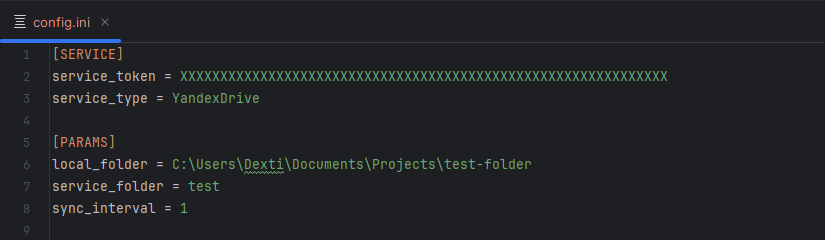
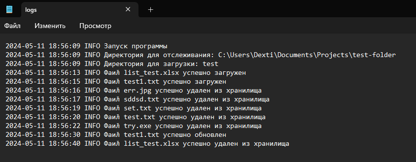

## Сервис автоматической синхронизации файлов
### Описание
1)	Связывание указанной папки на локальном компьютере и в облачном хранилище
2)	Отслеживание изменений в файлах на локальном компьютере и внесение изменений в облачном хранилище

### Развертывание и использование
1)  Скопировать репозиторий
    ```
    $ git clone https://github.com/Dextiles/Files-Auto-Synchronizer
    ```
2)  Установить необходимые зависимости
    ```
    $ pip install -r requirements.txt
    ```
3)  Создать файл <code>config.ini</code> и настроить его ([подробнее](#настройка))
4)  Запустить исполняемый файл
    ```
    $ python3 main.py
    ```
5)  Для остановки скрипта необходимо нажать <code>Enter</code> в терминале рабочего скрипта
6)  Логи можно посмотреть в папке <code>logs/</code> корневого раздела проекта ([подробнее](#логирование))

### Настройка

Для использования сервиса необходимо провести его первичную настройку, 
для этого необходимо создать файл <code>config.ini</code><br>
1. Инициализировать 2 заголовка: <code>[SERVICE]</code> и <code>[PARAMS]</code>
2. В <code>[SERVICE]</code> необходимо создать 2 параметра:
   + <code>service_token</code> - содержит рабочий токен облачного сервиса
   + <code>service_type</code> - указание типа облачного сервиса
3. В <code>[PARAMS]</code> необходимо создать 3 параметра:
   + <code>local_folder</code> - полный путь к отслеживаемой папке
   + <code>service_folder</code> - название папки в облачном хранилище, где будут храниться файлы
   + <code>sync_interval</code> - интервал обновления

<details>
  <summary>Пример <code>config.ini</code> файла</summary>
  <figure>
    
    <figcaption>Пример config.ini файла</figcaption>
  </figure>
</details>

> В случае отсутствия <code>config.ini</code> файла или его неправильной настройки программа не запуститься

<table>
  <caption>Доступные облачные сервисы</caption>
  <thead>
    <tr align="center">
      <td>№</td>
      <td>Название</td>
      <td>Сылка</td>
      <td>Название для <code>config.ini</code></td>
      <td>Статус</td>
    </tr>
  </thead>
  <tbody>
    <tr>
      <td>1</td>
      <td>Яндекс.Диск</td>
      <td><a href="https://disk.yandex.ru/">disk.yandex.ru</a></td>
      <td align="center"><samp>YandexDrive</samp></td>
      <td align="left">&#10004; Внедрен</td>
    </tr>
    <tr>
      <td>2</td>
      <td>Google Drive</td>
      <td><a href="https://www.google.ru/drive/">www.google.ru/drive</a></td>
      <td align="center"><samp>GoogleDrive</samp></td>
      <td align="left">&#10006; В разработке</td>
    </tr>
    <tr>
      <td>3</td>
      <td>Dropbox</td>
      <td><a href="https://www.dropbox.com/">www.dropbox.com</a></td>
      <td align="center"><samp>Dropbox</samp></td>
      <td align="left">&#10006; В разработке</td>
    </tr>
    <tr>
      <td>4</td>
      <td>iCloud</td>
      <td><a href="https://www.icloud.com/">www.icloud.com</a></td>
      <td align="center"><samp>iCloud</samp></td>
      <td align="left">&#10006; В разработке</td>
    </tr>
    <tr>
      <td>5</td>
      <td>OneDrive</td>
      <td><a href="https://onedrive.live.com/?wdo=1&id=root">onedrive.live.com</a></td>
      <td align="center"><samp>OneDrive</samp></td>
      <td align="left">&#10006; В разработке</td>
    </tr>
  </tbody>
</table>

### Логирование

Для отслеживания всех процессов, происходящих в сервисе предусмотрено логирование<br>
В логах создано 2 уровня:<br>
<code>INFO</code> - для отображения процессов работы с облачным хранилищем<br>
<code>ERROR</code> - для отображения всех отловленных ошибок

Лог-файл располагается в корневой директории проекта в папке <code>/logs/</code><br>
Полный путь (относительно проекта) для него будет таким:<br>
<code>/logs/logs.log</code>

<details>
  <summary>Пример <code>logs.log</code> файла</summary>
  <figure>
    
    <figcaption>Пример лог файла</figcaption>
  </figure>
</details>
